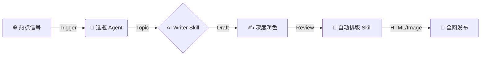

# 🚀 微信公众号 AI 自动化 Skills！提效狂魔的终极进化指南

> **导读**：
> 还在手动排版？还在为选题抓耳挠腮？在这个 AI Agent 爆发的时代，公众号运营早已不再是拼体力的战场。本文将带你深度解构 **AI 自动化 Skills** 的核心逻辑，手把手教你打造一套 "提效狂魔" 级的自动化工作流，让内容生产效率提升 10 倍不止。

---

## 🌌 什么是 AI 自动化 Skills？

我们常说的 "AI 写作"，往往停留在这个阶段：打开 ChatGPT -> 输入提示词 -> 复制粘贴。
但 **AI 自动化 Skills** 是一个质的飞跃。它不再是单一的 "工具调用"，而是将 **复杂的运营SOP（标准作业程序）封装成可复用的代码 or Agent 能力**。

### 核心定义
Skill (技能) = **特定任务逻辑** + **AI 模型能力** + **外部工具 API**

想象一下，你的电脑不再只是一个编辑器，而是一个拥有无数 "数字员工" 的 **指挥中心**。
*   **Skill A**: 负责从 Twitter 抓取最新技术热点 (`tweet-to-twitter`)
*   **Skill B**: 负责将技术文档转化为通俗易懂的深读文章 (`wechat-tech-writer`)
*   **Skill C**: 负责将 Markdown 自动渲染为微信及全平台的排版格式 (`wechat-article-formatter`)

这不仅仅是 "提效"，这是 **生产关系的重构**。

---

## ⚙️ 核心架构：工作流的 "黑盒" 解密

一个成熟的 AI 自动化 Skill 体系，通常遵循 **MCP (Model Context Protocol)** 思想，由以下三层构成：

### 1. 感知层 (Perception Layer) 📡
这是 Skill 的 "眼睛"。它不仅是被动接收指令，还能主动监听信号。
*   **Monitor**: 监控特定 RSS 源、Social Media 趋势 or GitHub Trending。
*   **Trigger**: 当检测到 "高价值信息"（如 Star 数激增的项目）时，自动触发后续流程。

### 2. 决策与处理层 (Cognition Layer) 🧠
这是 Skill 的 "大脑"。
*   **Prompt Chain**: 将复杂的写作任务拆解为 `大纲生成` -> `草稿填充` -> `风格润色` -> `反思优化` 4个步骤。
*   **Context Management**: 自动读取本地知识库（如 `/Documents/兰秋说AI/skills`），确保输出内容符合你的个人品牌调性（Tone of Voice）。

### 3. 执行层 (Action Layer) ⚡
这是 Skill 的 "手"。
*   **Formatter**: 自动根据 `markdown` 生成带 CSS 样式的 HTML。
*   **Publisher**: 通过 API or RPA 技术，一键分发到微信、知乎、掘金等平台。



---

## 🛠️ 实战教程：构建你的第一个 "技术写手" Skill

我们以 `wechat-tech-writer` 为例，看看如何从零构建一个 "提效狂魔"。

### Step 1: 定义 Skill 配置文件 (`SKILL.md`)
不要把 Prompt 散落在各处，像管理代码一样管理你的 Prompt。

```yaml
---
name: wechat-tech-writer
version: 2.0
role: 深度技术博主
style: 极客、理性、干货满满
input: 技术文档 URL / GitHub Repo
output: 深度解析文章 (Markdown)
---
```

### Step 2: 设计 "由浅入深" 的搜索策略
AI 写不出深度文章？是因为你没喂给它足够深度的信息。并在 Python 脚本中实现以下 **4轮搜索逻辑**：

1.  **Foundation**: 搜索官方文档、Wiki，确立核心概念的准确性。
2.  **Application**: 搜索 "Best Practices"、"Common Pitfalls"，增加实战厚度。
3.  **Evaluation**: 搜索 "Vs Competitors"、"Reddit Discussions"，引入批判性视角。
4.  **Customization**: 根据生成的草稿，查漏补缺。

### Step 3: 自动化排版注入
文章写好了，排版还要半小时？
使用 CSS 注入技术，直接将 Markdown 转换为微信样式的 HTML。

```css
/* 科技风标题示例 */
h2 {
    border-left: 4px solid #007aff;
    padding-left: 12px;
    font-weight: 800;
    letter-spacing: 1px;
    background: linear-gradient(90deg, rgba(0,122,255,0.1) 0%, rgba(255,255,255,0) 100%);
}
```

---

## 🔮 深度总结：超级个体的未来

"提效狂魔" 的终极形态，不是你打字更快了，而是 **你不再需要打字了**。

当你拥有了 `wechat-tech-writer`、`tweet-to-twitter`、`algorithmic-art` 这些 Skills 后，你就不再是一个单纯的 "创作者"，你是一个 **AI 舰队的指挥官**。

*   **以前**：花费 4 小时写一篇文章。
*   **现在**：花费 10 分钟 Review Agent 生成的 3 个版本，选择最好的一个进行微调。

**未来已来，不要做工具的使用者，要做 Skills 的开发者。**

---
> *本文由 `wechat-tech-writer` 辅助生成，归档于 2026-01-02.*
