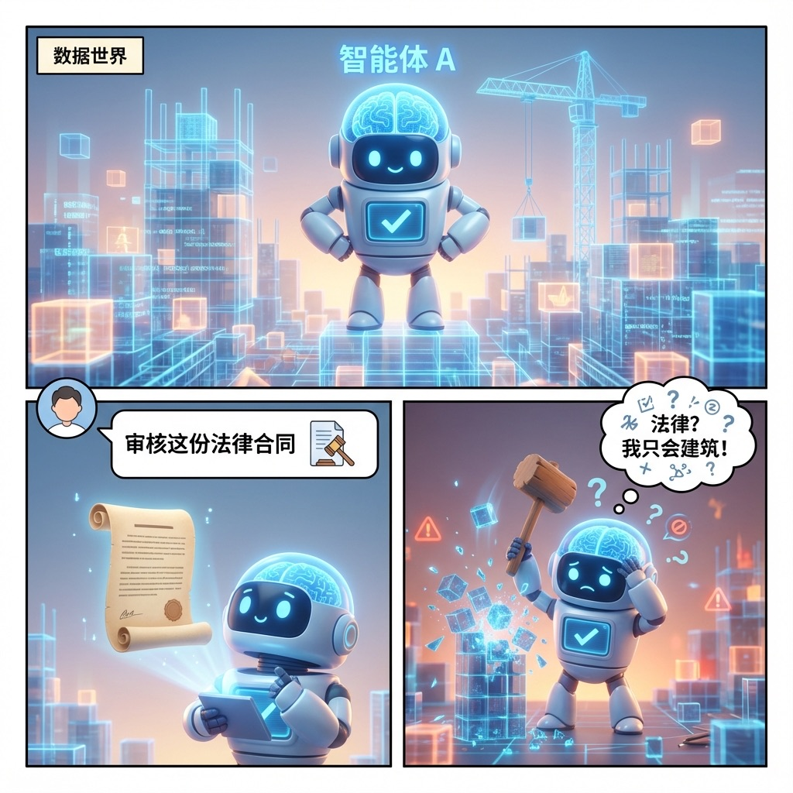
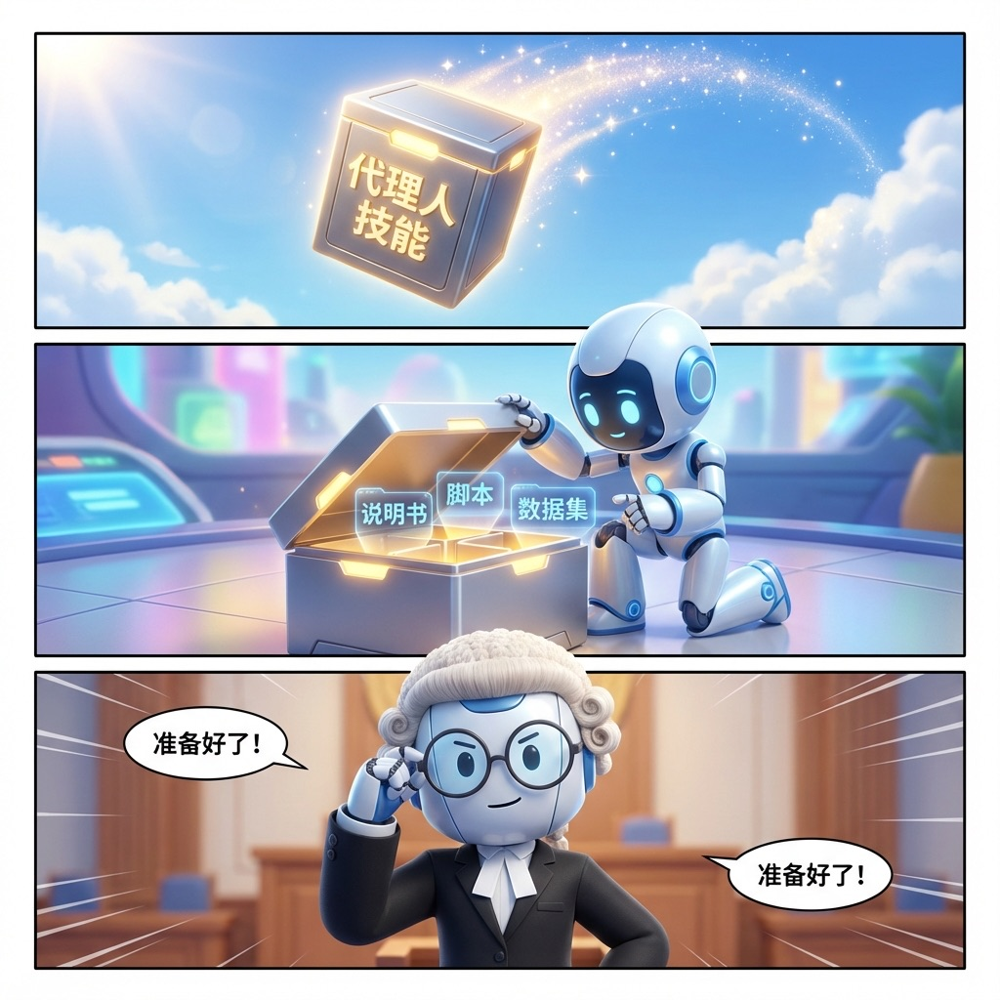
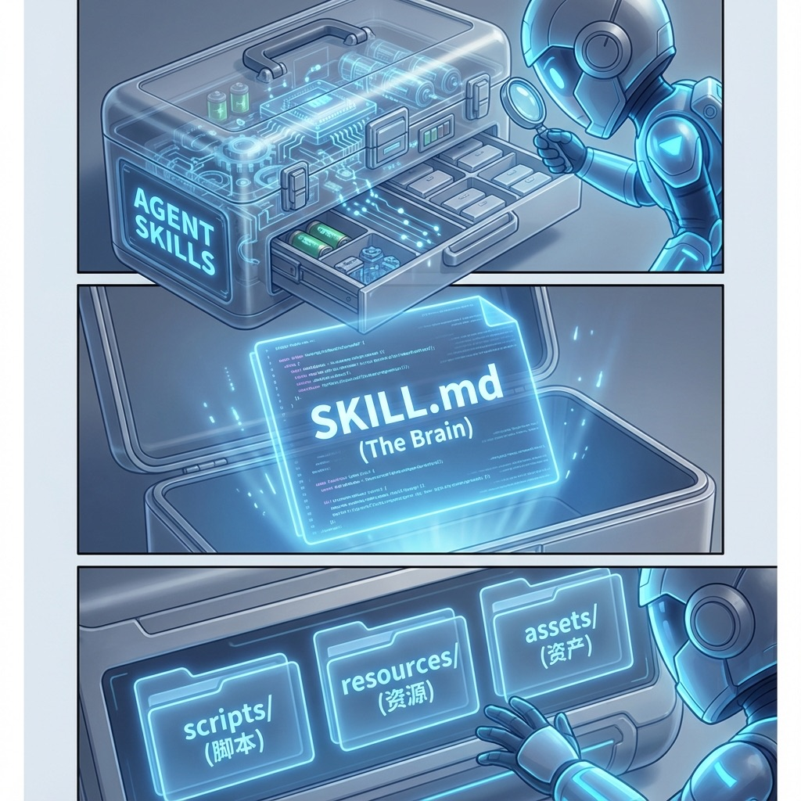
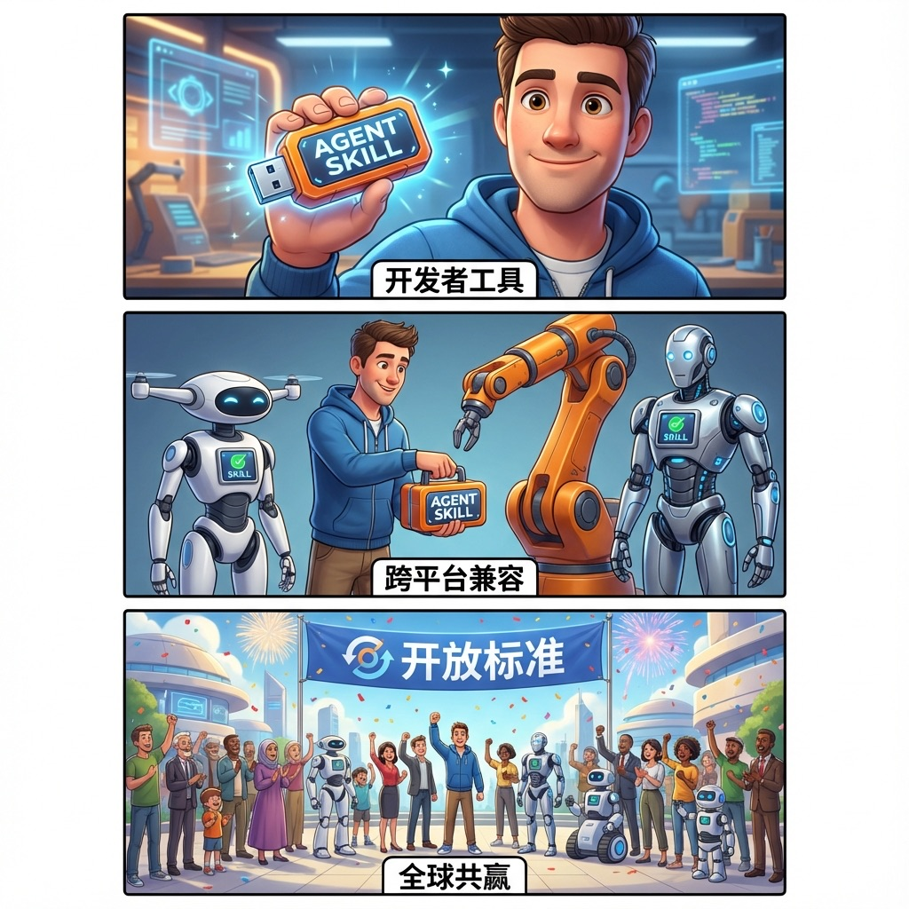
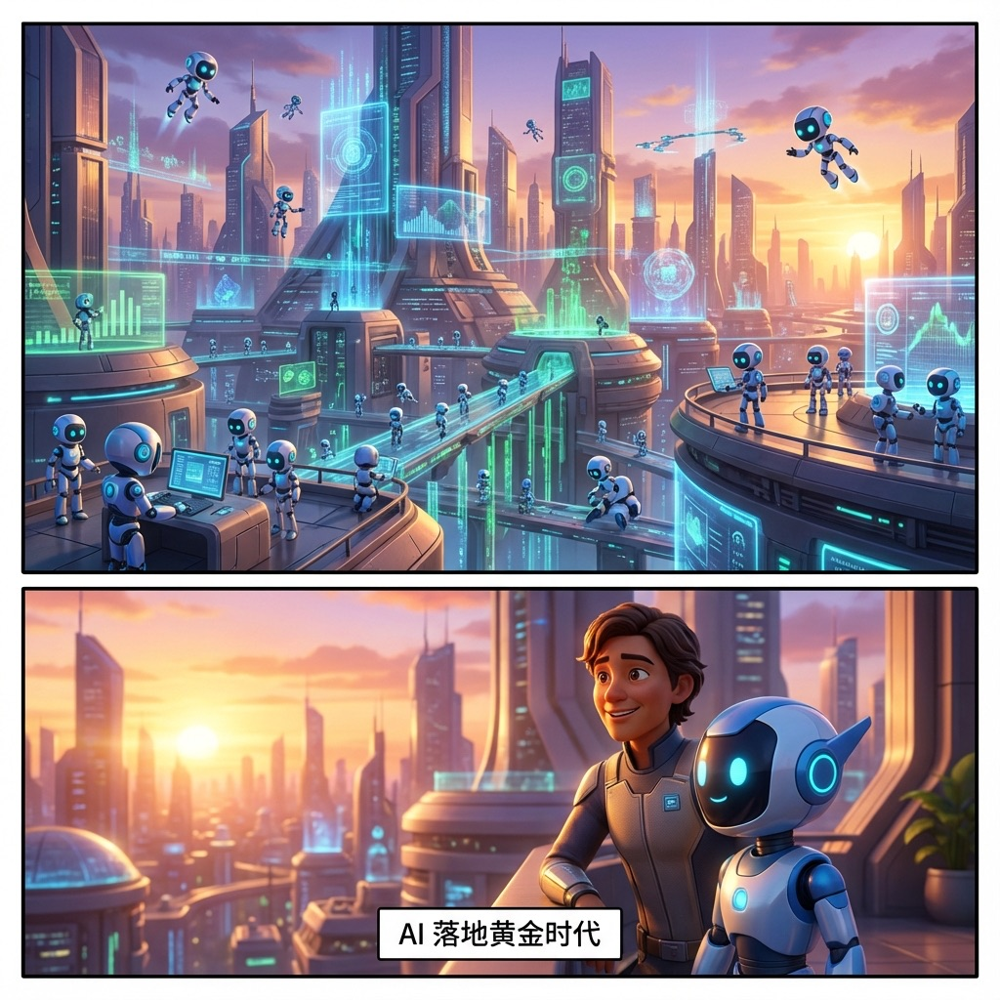

> **摘要**：传统的漫画创作往往受限于绘画技巧 and 漫长的分镜规划。本文将揭秘一套基于 Google NotebookLM、Gemini 3.0、Nano Banana Pro 的全新二创流水线。通过将专业论文、技术文档转化为极具视觉冲击力的漫画，我们不仅能实现信息的视觉化降维，更能通过 AI 保持分镜与角色的高度一致性。

---

## 一、 引言：当“深度内容”遭遇“视觉饥渴”

在这个信息爆炸的时代，深度技术内容（如 AI 代理架构、行业研究报告）往往面临一个尴尬的境地：**内容含金量极高，但阅读门槛也极高。**

许多读者在面对动辄上万字的 PDF 时，往往会陷入“收藏即吃灰”的怪圈。如何让生涩的技术逻辑变得直观、有趣且具有传播力？

**答案是：漫画。**

但问题也随之而来：绝大多数技术博主并不会画画，而传统的漫画外包周期长、沟通成本高，且难以捕捉精准的技术隐喻。

随着 AI 技术的爆发，尤其是 **NotebookLM** 的逻辑提取能力与 **Gemini 3.0** 的分镜规划能力、**Nano Banana Pro** 在图像一致性上的突破，一套“全自动 AI 漫画工作流”已经浮出水面。今天，我们将以《Agent Skills：标准化框架》为例，手把手教你如何用 AI 创作出专业级漫画。

---

## 二、 三步破局：AI 漫画创作的“黄金套路”

想要用 AI 拍出高质量漫画，关键不在于“生成图片”，而在于“逻辑拆解”。我们将整个工作流分为三个阶段：

### 1. 内容“脱水”：使用 NotebookLM 提取核心逻辑

第一步，你需要一个“懂你”的 AI 老师。NotebookLM 的优势在于它能“基于源接地”进行推理，不会胡乱产生幻觉。

*   **操作**：将复杂的论文、URL 或视频脚本上传至 NotebookLM。
*   **产出**：通过 AI 指令（Prompt）提取出内容中的**核心隐喻**和**关键转折点**。
*   **示例**：将《Agent Skills》中的“能力封装”概念提取为“大师工具箱”这个视觉隐喻。

### 2. 分镜“导演”：让 Gemini 生成视觉剧本

有了内容概要后，需要将其转化为漫画特有的分镜语言。

*   **操作**：将 NotebookLM 提取的论文精华丢给 Gemini，要求其生成“6 页漫画规划”。
*   **核心指令**：要求 AI 分析每页的**痛点、概念、解剖、实战、生态、未来**。
*   **关注点**：分镜建议中必须包含具体的画面元素（场景、人物动作、对白、旁白）。

### 3. 视觉“成膜”：利用 Nano Banana Pro 实现风格一致性

这是最关键的一步。传统的 AI 绘图最怕“画着画着换了人”。

*   **操作**：使用具有强大空间理解能力的 **Nano Banana Pro** 直接生成 3:4 的竖屏分镜。
*   **技巧**：在 Prompt 中锁定人物形象（如：Sleek Robot with glowing brain） and 画风（如：Pixar-style 3D cartoon）。

---

## 三、 实战案例：漫画化解析《Agent Skills》

下面，我们来看看基于上述工作流，如何将一份抽象的 AI 手册转化为生动的漫画。

> [!NOTE]
> 以上图片由 AI 直接从论文原文生成。你会发现，虽然角色形态保持了高度统一（可爱的发光大脑机器人），但场景却随着逻辑的深入从“混乱工地”演变成了“未来智慧城市”。

---

## 四、 深度特写：如何保持 AI 漫画的人物一致性？

这是新手最头疼的问题：为什么我的主角在第一页是圆脸，第二页成了方脸？在本次创作中，我们应用了三项核心技术：

1.  **特征锚定 (Character Anchoring)**：在所有 Prompt 的开头，必须包含一段 50 字以内的高度精确、且具有排他性的外貌描述。例如：“A sleek, white, modular robot with a translucent blue glowing brain and a friendly digital face (Agent A)”。
2.  **参考图引用 (Image Reference)**：在 Gemini 3.0 中，你可以通过引导让 AI 记住前一张图片的 seed 或视觉权重。
3.  **风格控制 (Style Tokens)**：使用一致的风格关键词（如 Pixar 风格、Soft lighting、8K resolution），确保分镜的影调不会忽明忽暗。

---

## 五、 结语：每个人都是漫画家的时代

AI 漫画创作不仅仅是“节省了画师的钱”，它更深层的意义是：**它极大地缩短了从“想法”到“视觉影响力”的路径。**

当你掌握了 NotebookLM + Gemini 的这套组合拳，你不仅能处理论文，还能处理小说、电影剧本、甚至是你的产品发布会大纲。在不远的未来，沟通的语言或许将不再是冰冷的文字，而是跃然纸上的画面。

**在这个 AI 落地黄金时代，你准备好开启你的“大师工具箱”了吗？**

---

> [!TIP]
> **作者建议**：如果你还不熟悉 Prompt 工程，可以尝试多给 AI 一些具体的类比。记住，AI 懂逻辑，但它需要你给它一个“灵魂隐喻”。
