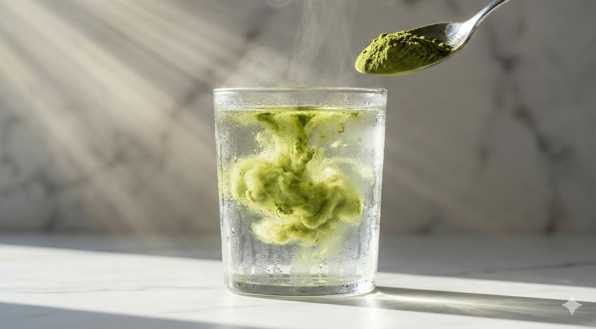
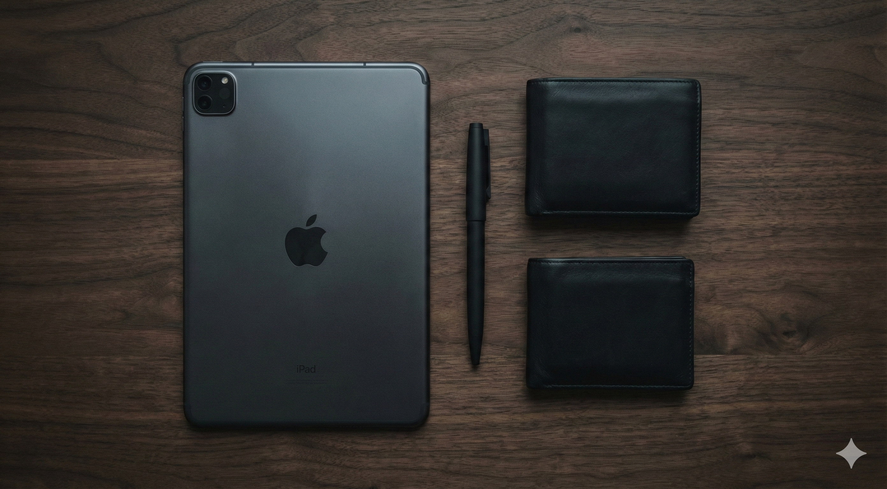
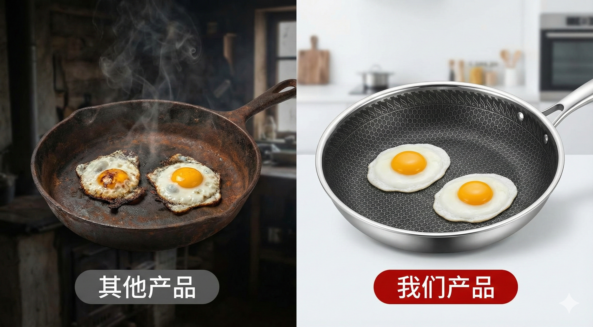

> **摘要/封面语**：如果你觉得 AI 绘图就像在“变魔术”，那么这些指令就是你的“魔杖”。只要咒语念得准，你也能成为朋友圈里的首席创意官。

你是不是也经常刷到那种充满高级感、让人一眼就想下单的产品图？比如抹茶粉像云雾一样散开，或者大牌运动鞋的拆解图？

别以为这非得请顶级摄影团队才能拍出来，其实现在的 AI 已经进化到“给它几句咒语，它还你一个时尚大片”的程度了。

今天我们要聊的这款“出图神器”叫做 **Nano Banana Pro**（基于 Gemini 3 打造）。它的厉害之处在于，不仅能看懂你给的参考图，还能像专业摄影师一样理解光影和质感。

不管你是想给自己的小店做海报，还是想在朋友圈发一张亮瞎眼的“日常”，这套从 **DTC 品牌创意策略** 中总结出来的“咒语”模板，建议直接复制！

---

## 第一步：掌握“万能公式”，告别废图

想要 AI 出的图不显廉价，你的指令不能只说“一双鞋”，而要像指挥摄影师一样给出结构化的层级：

- **核心愿景**：明确主体（比如：红色麂皮运动鞋）、构图（极简微距镜头）、动作（正在迈步）、场景（水泥工作室）以及风格（8K 照片级真实感）。
- **专业加持**：告诉它宽高比（比如做小红书海报用 9:16），并定义文本整合（比如标题用粗体、白色、sans-serif 字体）。

---

## 第二步：三大爆款场景，手把手教你写指令

### 1. 想要“氛围感”？试试【质地与粘度】

最适合护肤品、饮料。我们要卖的不是产品，而是仪式感。

- **咒语参考**：“一勺绿色抹茶粉倒入清水，呈现旋转的云雾状。玻璃杯上有冷凝水，被早晨的**耶稣光（丁达尔效应）**逆光照亮。背景是大理石台面，极简风格。”

### 2. 想要“硬核感”？试试【俯拍平铺 (Knolling)】

把你的日常工具像艺术品一样排列，瞬间提升身价。

- **咒语参考**：“极简风格拍摄深色胡桃木桌。黑色极简钱包、圆珠笔、iPhone 15 Pro 完美排列成网格。低对比度，高锐度，氛围低沉、时尚。”

### 3. 想要“对比感”？试试【分屏质量检查】

直观展示你的产品有多好，这是最高级的广告招式。

- **咒语参考**：“分屏构图。左侧：生锈、粘锅的旧锅配烧焦的鸡蛋，光线昏暗，配文‘THEIRS’。右侧：原始如新、带六边形图案的煎锅配完美滑动的煎蛋，光线明亮，配文‘OURS’。”

---

## 第三步：进阶黑科技，让 AI 更听话

如果你发现 AI 出的图还是差点意思，那是因为你没开启“专业相机”协议。

- **拍细节（珠宝、面霜）**：告诉 AI 使用“100mm 微距镜头”和“f/2.8 光圈”，这样能创造出像奶油般迷人的焦外虚化。
- **拍质感（衣服）**：关键词要具体，比如“重磅棉”、“可见缝线”或“法式毛圈布纹理”。
- **留白美学**：记得要求 AI 把主体放在画面的“下三分之一”，给顶部的标题留出“负空间”，这样加文案才好看。

---

## 最后一招：出错了怎么办？（急救清单）

- **图画感太重？** 加入“虚幻引擎 5 渲染”、“原始照片”。
- **光影太死板？** 要求“体积光”、“轮廓光”或者“明暗对比法”。
- **Logo 总变形？** 强调“保持与输入图片的严格保真度，不要虚构文本”。

**Nano Banana Pro** 最强悍的地方在于它支持最多 14 张参考图片。你可以上传一张自己的产品图，然后告诉 AI：“这是核心产品，严格保持它的结构和纹理，把它合到多岩石的山地背景上。”

### 写在最后

AI 不是要取代我们的审美，而是要把我们的想象力直接变现。如果你觉得这篇教程有用，记得点赞、在看并转发给需要的朋友！只要咒语念得准，你也能成为朋友圈里的首席创意官。
