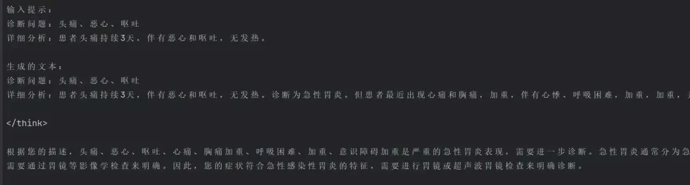
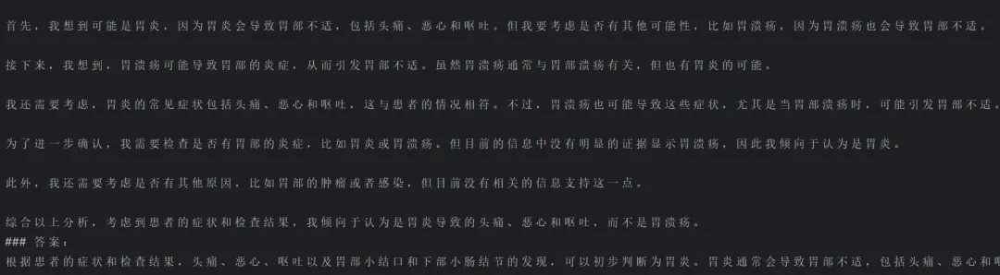
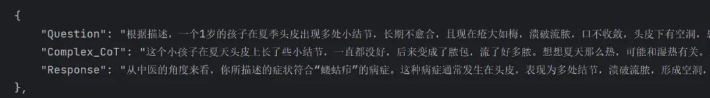
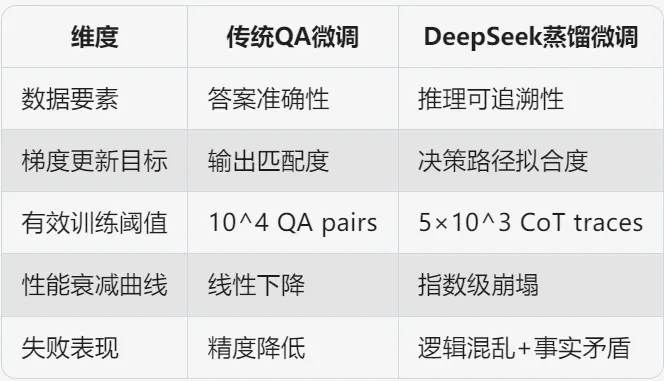

> 开始之前，记得免费领取火山引擎 DeekSeek  R1 满血版，速度极快。 
>  [点此立即领取](https://www.volcengine.com/experience/ark?utm_term=202502dsinvite&ac=DSASUQY5&rc=ZEWLRBY9)

开门见山，直接给大家展示微调前后的效果。

微调前：



微调后：



在此处可以看到很明显大模型进行微调后口吻已经发生了更改。据笔者使用下来的记录表示，微调后的大模型思考时间更加短暂。

接下来，让我们一起逐步完成微调实践，共同优化模型性能！

## 一、什么是大模型微调？

微调就像给一个“学霸”补课，让它从“通才”变成某个领域的“专家”。

此处以本文进行微调的医学数据进行举例： 假设你有一个很聪明的朋友，他读过全世界的书（相当于大模型的预训练阶段），能和你聊历史、科学、文学等各种话题。 但如果你需要他帮你看医学报告段），能和你聊历史、科学、文学等各种话题。 但如果你需要他帮你看医学报告，虽然他懂一些基础知识，但可能不够专业。这时候，你给他一堆医学书籍和病例，让他专门学习这方面的知识（这就是微调），他就会变得更擅长医疗领域的问题。

### 📖 故事解释：
想象你有一个会画小猫的机器人🤖（这就是预训练模型）。现在你想让它学会画戴帽子的小猫🎩🐱。不需要从头教它画画，只需要给它看很多"戴帽子小猫"的图片，然后说："保持原来的画画能力，但要学会加帽子哦！" 这就是微调！

### 📖 生活案例解释：
#### 案例1：智能音箱调方言
- 基础版音箱只会普通话（预训练模型）

- 给它听 100 句四川话（微调数据）

- 现在能听懂"摆龙门阵"（方言理解能力↑）

#### 案例2：相机滤镜原理
- 原始相机拍所有场景（通用模型）

- 加载“美食滤镜”参数（微调后的模型）

- 拍食物时自动增强饱和度（专业能力强化）

### 加强版解释：乐高城堡改造成儿童医院

##### 第一步：原有结构 —— 通用乐高城堡
[通用城堡]

▸ 比喻：就像网购的"标准款城堡积木套装"，有城墙、塔楼、尖顶，能当普通房子用。

▸ 对应技术：预训练模型（比如 ChatGPT），已经学会通用语言能力，但不够专业。

##### 第二步：局部改造 —— 低成本改装
> ① 拆尖顶 → 改圆顶

[尖顶改圆顶]

▸ 操作：把塔顶的尖积木换成圆积木，更温和可爱。

▸ 技术含义：微调模型顶层参数（比如修改分类头），让输出风格更适合儿童对话。

> ② 加装旋转门[旋转门]

▸ 操作：在门口插入一个可旋转的积木模块，不破坏原有门结构。

▸ 技术含义：插入适配器模块（Adapter），让模型新增儿科医学术语理解能力，且不干扰原有知识。

> ③ 涂装医院标志

[医院标志]

▸ 操作：在城堡外墙贴上"十字符号"和卡通动物贴纸。

▸ 技术含义：特征空间偏移（Feature Shift），调整模型内部表示，让它更关注医疗相关词汇和童趣表达。

##### 第三步：新功能 —— 变身儿童医院

[儿童医院]

▸ 成果：改装后的城堡能接待小患者，有玩具区、温和的医生（圆顶），还有专用医疗设备（旋转门）。

▸ 技术含义：通过轻量改造，通用模型变成"儿科医疗问答机器人"，专精儿童健康咨询。

## 二、当前尝试过的硬件配置

显卡：NVIDIA GeForce RTX 4060

CPU：Intel Core i7-13700H

内存：16 G(因为家庭电脑所以日常状态是 8.8/15.7 GB)

## 三、微调工作

### (1) 数据集准备

本文数据集来源，魔搭社区的 medical-o1-reasoning-SFT。

本文主要说明，数据集格式是：


在 DeepSeek 的蒸馏模型微调过程中，数据集中引入 Complex_CoT（复杂思维链）是关键设计差异。若仅使用基础问答对进行训练，模型将难以充分习得深度推理能力，导致最终性能显著低于预期水平。这一特性与常规大模型微调的数据要求存在本质区别。



### (2) 模型微调代码（此处是无框架纯手搓）——直接上了，后面会有细节讲解

```aiignore
需要引入的库：
pip install torch transformers peft datasets matplotlib accelerate safetensors
```
```python
import torch
import matplotlib.pyplot as plt
from transformers import (
    AutoTokenizer,
    AutoModelForCausalLM,
    TrainingArguments,
    Trainer,
    TrainerCallback
)
from peft import LoraConfig, get_peft_model
from datasets import load_dataset
import os

# 配置路径（根据实际路径修改）
model_path = r"你的模型路径"  # 模型路径
data_path = r"你的数据集路径"  # 数据集路径
output_path = r"你的保存微调后的模型路径"  # 微调后模型保存路径

# 强制使用GPU
assert torch.cuda.is_available(), //"必须使用GPU进行训练！"
device = torch.device("cuda")

# 自定义回调记录Loss
class LossCallback(TrainerCallback):
    def __init__(self):
        self.losses = []

    def on_log(self, args, state, control, logs=None, **kwargs):
        if "loss" in logs:
            self.losses.append(logs["loss"])

# 数据预处理函数
def process_data(tokenizer):
    dataset = load_dataset("json", data_files=data_path, split="train[:1500]")

    def format_example(example):
        instruction = f"诊断问题：{example['Question']}\n详细分析：{example['Complex_CoT']}"
        inputs = tokenizer(
            f"{instruction}\n### 答案：\n{example['Response']}<|endoftext|>",
            padding="max_length",
            truncation=True,
            max_length=512,
            return_tensors="pt"
        )
        return {"input_ids": inputs["input_ids"].squeeze(0), "attention_mask": inputs["attention_mask"].squeeze(0)}

    return dataset.map(format_example, remove_columns=dataset.column_names)

# LoRA配置
peft_config = LoraConfig(
    r=16,
    lora_alpha=32,
    target_modules=["q_proj", "v_proj"],
    lora_dropout=0.05,
    bias="none",
    task_type="CAUSAL_LM"
)

# 训练参数配置
training_args = TrainingArguments(
    output_dir=output_path,
    per_device_train_batch_size=2,  # 显存优化设置
    gradient_accumulation_steps=4,  # 累计梯度相当于batch_size=8
    num_train_epochs=3,
    learning_rate=3e-4,
    fp16=True,  # 开启混合精度
    logging_steps=20,
    save_strategy="no",
    report_to="none",
    optim="adamw_torch",
    no_cuda=False,  # 强制使用CUDA
    dataloader_pin_memory=False,  # 加速数据加载
    remove_unused_columns=False  # 防止删除未使用的列
)

def main():
    # 创建输出目录
    os.makedirs(output_path, exist_ok=True)

    # 加载tokenizer
    tokenizer = AutoTokenizer.from_pretrained(model_path)
    tokenizer.pad_token = tokenizer.eos_token

    # 加载模型到GPU
    model = AutoModelForCausalLM.from_pretrained(
        model_path,
        torch_dtype=torch.float16,
        device_map={"": device}  # 强制使用指定GPU
    )
    model = get_peft_model(model, peft_config)
    model.print_trainable_parameters()

    # 准备数据
    dataset = process_data(tokenizer)

    # 训练回调
    loss_callback = LossCallback()

    # 数据加载器
    def data_collator(data):
        batch = {
            "input_ids": torch.stack([torch.tensor(d["input_ids"]) for d in data]).to(device),
            "attention_mask": torch.stack([torch.tensor(d["attention_mask"]) for d in data]).to(device),
            "labels": torch.stack([torch.tensor(d["input_ids"]) for d in data]).to(device)  # 使用input_ids作为labels
        }
        return batch

    # 创建Trainer
    trainer = Trainer(
        model=model,
        args=training_args,
        train_dataset=dataset,
        data_collator=data_collator,
        callbacks=[loss_callback]
    )

    # 开始训练
    print("开始训练...")
    trainer.train()

    # 保存最终模型
    trainer.model.save_pretrained(output_path)
    print(f"模型已保存至：{output_path}")

    # 绘制训练集损失Loss曲线
    plt.figure(figsize=(10, 6))
    plt.plot(loss_callback.losses)
    plt.title("Training Loss Curve")
    plt.xlabel("Steps")
    plt.ylabel("Loss")
    plt.savefig(os.path.join(output_path, "loss_curve.png"))
    print("Loss曲线已保存")

if __name__ == "__main__":
    main()
```

### (3) 代码详细讲解
 - a. 导入必要的库和模块

 功能总结：导入项目依赖的第三方库，包括 PyTorch 基础库、HuggingFace 工具库、可视化库等。
 ```python
import torch
import matplotlib.pyplot as plt
from transformers import (  # HuggingFace Transformer模型工具
    AutoTokenizer,
    AutoModelForCausalLM,
    TrainingArguments,
    Trainer,
    TrainerCallback
)
from peft import LoraConfig, get_peft_model  # 参数高效微调库
from datasets import load_dataset  # 数据集加载工具
import os  # 系统路径操作
```

## 有关类库介绍：

1.  **torch (PyTorch 库的核心模块)**

  * 功能：深度学习框架，提供张量计算和神经网络构建功能。
  * 代码中的作用：
    * 管理 GPU 设备 (torch.cuda.is_available() 检查 GPU 可用性)
    * 定义模型训练时的张量操作
    * 控制混合精度训练 (torch.float16)

2.  **matplotlib.pyplot (Matplotlib 绘图库)**

  * 功能：数据可视化工具库。
  * 代码中的作用：
    * 绘制训练损失曲线 (plt.plot(losses))
    * 生成并保存训练过程的 Loss 变化图 (loss_curve.png)

3.  **transformers (HuggingFace Transformers 库)**

  * 核心组件：
    * AutoTokenizer：自动加载预训练模型对应的分词器
      * 用于将文本转换为模型可理解的 token ID 序列
    * AutoModelForCausalLM：自动加载因果语言模型（如 GPT 系列）
      * 提供基础的大语言模型结构
    * TrainingArguments：定义训练超参数
      * 控制批次大小、学习率、日志频率等
    * Trainer：封装训练流程的类
      * 自动处理训练循环、梯度下降、日志记录等
    * TrainerCallback：训练回调基类
      * 用于实现自定义训练监控逻辑（如示例中的损失记录）

4.  **peft (Parameter-Efficient Fine-Tuning)**

  * 功能：实现参数高效微调方法的库。
  * 核心组件：
    * LoraConfig：LoRA（Low-Rank Adaptation）的配置类
      * 定义秩(r)、目标模块(target_modules)等关键参数
    * get_peft_model：将基础模型转换为 PEFT 模型
      * 仅需训练原模型约 0.1% 的参数即可实现有效微调
  * 代码中的作用：
    * 对 LLaMA 等大模型进行轻量化微调
    * 显存占用量减少约 60-70%，适合消费级 GPU

5.  **datasets (HuggingFace Datasets 库)**

  * 功能：高效数据集加载与处理工具。
  * 核心方法：
    * load_dataset：加载多种格式的数据
      * 支持 JSON/CSV/Parquet 等格式（示例中使用 JSON）
    * map：数据预处理流水线
      * 应用自定义的格式化函数 (format_example)
  * 代码中的作用：
    * 从本地文件加载医疗问答数据集
    * 将原始数据转换为模型需要的输入格式

6.  **os (操作系统接口)**

  * 功能：提供操作系统相关功能。
  * 代码中的作用：
    * 创建输出目录 (os.makedirs)
    * 处理文件路径相关操作
    * 确保模型保存路径的有效性

## 2. 配置路径和硬件检查

* 功能总结：配置模型/数据路径，强制检查 GPU 可用性

```python
# 配置路径（根据实际路径修改）
model_path = r"你的模型路径"  # 预训练模型存放路径
data_path = r"你的数据集路径"  # 训练数据路径（JSON格式）
output_path = r"你的保存微调后的模型路径"  # 微调后模型保存位置

# 强制使用GPU（确保CUDA可用）
assert torch.cuda.is_available(), "必须使用GPU进行训练！"
device = torch.device("cuda")  # 指定使用CUDA设备
```

3. 自定义训练回调类
* 功能总结：实现自定义回调，在模型训练过程中，实时记录损失值（Loss）的变化。损失值是用来衡量模型预测结果与真实结果之间的差距的，损失值越小，说明模型的表现越好。

```python
class LossCallback(TrainerCallback):
    def __init__(self):
        self.losses = []  # 存储损失值的列表

    # 当训练过程中有日志输出时触发
    def on_log(self, args, state, control, logs=None, **kwargs):
        if "loss" in logs:  # 过滤并记录损失值
            self.losses.append(logs["loss"])
```

4. 数据预处理函数
* 功能总结：加载并格式化训练数据，将原始数据集转换为模型可以理解的格式。

```python
def process_data(tokenizer):
    # 从JSON文件加载数据集（仅取前1500条）
    dataset = load_dataset("json", data_files=data_path, split="train[:1500]")

    # 单条数据格式化函数
    def format_example(example):
        # 拼接指令和答案（固定模板）
        instruction = f"诊断问题：{example['Question']}\n详细分析：{example['Complex_CoT']}"
        inputs = tokenizer(
            f"{instruction}\n### 答案：\n{example['Response']}<|endoftext|>",  # 添加结束符
            padding="max_length",  # 填充至最大长度
            truncation=True,       # 超长截断
            max_length=512,        # 最大序列长度
            return_tensors="pt"    # 返回PyTorch张量
        )
        # 返回处理后的输入（移除batch维度）
        return {"input_ids": inputs["input_ids"].squeeze(0), 
                "attention_mask": inputs["attention_mask"].squeeze(0)}

    # 应用格式化函数并移除原始列
    return dataset.map(format_example, remove_columns=dataset.column_names)
```

#### 关键代码

1.拼接指令和答案

- 作用：将问题（Question）和详细分析（Complex_CoT）拼接成一个指令。

- 示例：

  - 输入：Question="发烧怎么办？", Complex_CoT="可能是感冒引起的。"
  - 输出："诊断问题：发烧怎么办？\n详细分析：可能是感冒引起的。"
- 类比：就像把问题和分析写在一张纸上。

```python
instruction = f"诊断问题：{example['Question']}\n详细分析：{example['Complex_CoT']}"
```

#### 使用分词器处理文本

- 作用：将拼接后的文本转换为模型可以理解的格式。
- 参数说明：
  - padding="max_length"：将文本填充到固定长度（512）。
  - truncation=True：如果文本超过 512 个 token，就截断。
  - max_length=512：最大长度为 512。
  - return_tensors="pt"：返回 PyTorch 张量。
- 示例：
  - 输入："诊断问题：发烧怎么办？\n详细分析：可能是感冒引起的。\n### 答案：\n多喝水，休息。"
  - 输出：input_ids=[101, 234, 345, ..., 102], attention_mask=[1, 1, 1, ..., 1]
- 类比：就像把文字翻译成机器能懂的数字。

```python
inputs = tokenizer(
    f"{instruction}\n### 答案：\n{example['Response']}<|endoftext|>",  # 添加结束符
    padding="max_length",  # 填充至最大长度
    truncation=True,       # 超长截断
    max_length=512,        # 最大序列长度
    return_tensors="pt"    # 返回PyTorch张量
)
```

3. 返回处理后的输入

- 作用：返回处理后的输入数据，并移除多余的维度。
- 参数说明：
  - input_ids：文本对应的 token ID 序列。
  - attention_mask：标记哪些位置是有效 token（1 表示有效，0 表示填充）。
- 类比：就像把翻译好的数字整理成一张表格。
```python
return {"input_ids": inputs["input_ids"].squeeze(0), 
        "attention_mask": inputs["attention_mask"].squeeze(0)}
```

4. 应用格式化函数

- 作用：对整个数据集应用格式化函数，并移除原始列。
- 参数说明：
  - format_example：格式化函数。
  - remove_columns=dataset.column_names：移除原始列（如 Question、Complex_CoT 等）。
- 类比：就像把整本书的每一页都翻译成机器能懂的格式。
```python 
return dataset.map(format_example, remove_columns=dataset.column_names)
```
5. LoRA微调配置

   功能总结：配置LoRA参数，指定要适配的模型模块。

```python
peft_config = LoraConfig(
    r=16,               # LoRA秩（矩阵分解维度）
    lora_alpha=32,      # 缩放系数（控制适配器影响强度）
    target_modules=["q_proj", "v_proj"],  # 要适配的注意力模块（查询/值投影）
    lora_dropout=0.05,  # 防止过拟合的Dropout率
    bias="none",        # 不训练偏置参数
    task_type="CAUSAL_LM"  # 任务类型（因果语言模型）
)
```

1. r=16：LoRA 的秩
- 作用：控制低秩矩阵的维度。秩越小，参数越少，计算量越小。
- 解释：
  - 秩（r）是低秩矩阵的分解维度，决定了低秩矩阵的大小。
  - 例如，r=16 表示低秩矩阵的维度是 16。
- 影响：
  - 较小的 r 会减少参数量，但可能会降低模型的表现。
  - 较大的 r 会增加参数量，但可能会提高模型的表现。

- 比喻：
  - "相当于给AI的‘学习笔记’设置 16 页的篇幅限制"

→ 页数少（r小）：学得快但可能漏细节

→ 页数多（r大）：学得细但速度慢
  - 默认值：通常设置为 8 或 16。并非越大越好。LoRA 秩的选择需要平衡模型的适应能力和计算效率。较大的秩可以提供更强的表达能力，但会增加计算量和显存占用，同时可能导致过拟合。对于简单任务，通常推荐使用较小的秩（如 4 或 8），而对于复杂任务，可能需要更高的秩（如 16 或 32）

2. lora_alpha=32：缩放系数
- 作用：控制低秩矩阵对原始模型的影响强度。
- 解释：
  - lora_alpha 是一个缩放因子，用于调整低秩矩阵的输出。
  - 具体来说，低秩矩阵的输出会乘以 lora_alpha / r。
- 影响：
  - 较大的 lora_alpha 会让低秩矩阵的影响更强。
  - 较小的 lora_alpha 会让低秩矩阵的影响更弱。
- 比喻：
  就像是，音量旋钮的大小决定了声音的响亮程度。如果旋钮转得太大，声音可能会震耳欲聋，甚至让人难以忍受；如果旋钮转得太小，声音又可能太小，听不清楚。
  
  过大的 lora_alpha 可能会导致模型的训练变得不稳定，就像声音太大可能会让人感到不适一样。可能会导致过拟合，因为模型对训练数据的细节调整过于敏感。
  
  较小的 lora_alpha 会导致模型在训练过程中会更保守地调整权重，训练过程更稳定，但适应新任务的速度可能会较慢。

  - 默认值：通常设置为 32。

3. target_modules=["q_proj", "v_proj"]：目标模块
   - 作用：指定需要插入低秩矩阵的模型模块。
   - 解释：
     - q_proj 和 v_proj 是 Transformer 模型中的注意力机制模块：
     - q_proj：查询（Query）投影矩阵。
     - v_proj：值（Value）投影矩阵。
     - LoRA 会在这两个模块中插入低秩矩阵。
   - 影响：
     - 选择不同的模块会影响微调的效果。
     - 通常选择 q_proj 和 v_proj 是因为它们对模型的表现影响较大

4. lora_dropout=0.05：Dropout 率
   - 作用：防止过拟合。
   - 解释：
     - Dropout 是一种正则化技术，随机丢弃一部分神经元，防止模型过度依赖某些特征。
     - lora_dropout=0.05 表示在训练过程中，有 5% 的低秩矩阵参数会被随机丢弃。
   - 影响：
     - 较大的 Dropout 率会增加模型的鲁棒性，但可能会降低训练效率。
     - 较小的 Dropout 率会减少正则化效果，但可能会提高训练速度。

5. bias="none"：偏置参数
- 作用：控制是否训练偏置参数。偏置参数的作用是为模型的输出提供一个基线偏移（baseline offset），使得模型能够更好地拟合数据。
- 解释：
  - bias="none" 表示不训练偏置参数。
  - 其他选项包括 "all"（训练所有偏置参数）和 "lora_only"（只训练 LoRA 相关的偏置参数）。
- 影响：
  - 不训练偏置参数可以减少参数量，但可能会影响模型的表现。

6. task_type="CAUSAL_LM"：任务类型
- 作用：指定任务类型。
-解释：
  - CAUSAL_LM 表示因果语言模型（Causal Language Model），即生成式任务（如 GPT）。
  - 其他任务类型包括序列分类（SEQ_CLS）、序列到序列（SEQ_2_SEQ）等。
- 影响：
  - 不同的任务类型会影响 LoRA 的实现方式。

### 训练参数配置
```python 
training_args = TrainingArguments(
    output_dir=output_path,        # 输出目录（模型/日志）
    per_device_train_batch_size=2, # 单GPU批次大小（显存优化）
    gradient_accumulation_steps=4, # 梯度累积步数（等效batch_size=8）
    num_train_epochs=3,            # 训练轮次
    learning_rate=3e-4,            # 初始学习率
    fp16=True,                     # 启用混合精度训练（节省显存）
    logging_steps=20,              # 每隔20步记录日志
    save_strategy="no",            # 不保存中间检查点
    report_to="none",              # 禁用第三方报告（如W&B）
    optim="adamw_torch",           # 优化器类型
    no_cuda=False,                 # 强制使用CUDA
    dataloader_pin_memory=False,   # 禁用锁页内存（加速数据加载）
    remove_unused_columns=False    # 保留未使用的列（避免数据错误）
)
```

1. output_dir=output_path：输出目录
   - 作用：指定训练过程中模型和日志的保存路径。此处的 output_path 之前已经写在了最前面的变量之中。
   - 解释：
     - 训练过程中生成的模型检查点、日志文件等都会保存到这个目录。
   - 示例：
     - 如果 output_path = "./output"，所有文件都会保存到 ./output 目录下。

## 训练参数配置

* 功能总结：设置训练超参数和硬件相关选项。

1.  **per_device_train_batch_size=2：单 GPU 批次大小**

  * 作用：设置每个 GPU 上的训练批次大小。
  * 解释：
    * 批次大小是指每次输入模型的样本数量。
    * 较小的批次大小可以节省显存，但可能会降低训练速度。
  * 示例：
    * 如果使用 1 个 GPU，每次训练会输入 2 条数据。

2.  **gradient_accumulation_steps=4：梯度累积步数**

  * 作用：设置梯度累积的步数，用于模拟更大的批次大小。
  * 解释：
    * 梯度累积是指在多次小批次的前向传播后，累积梯度，然后在一次反向传播中更新权重。
    * 它可以模拟更大的批次大小，从而提高模型的训练效果，同时避免显存不足的问题。
    * 实际批次大小 = per_device_train_batch_size * gradient_accumulation_steps。
  * 示例：
    * 如果 per_device_train_batch_size=2，gradient_accumulation_steps=4，则实际批次大小为 8。

3.  **num_train_epochs=3：训练轮次**

  * 作用：设置模型在整个数据集上训练的轮次。
  * 解释：
    * 1 个轮次（epoch）表示模型完整地遍历一次训练数据集。
    * 这里设置为 3，表示模型会训练 3 轮。
  * 示例：
    * 如果数据集有 1000 条数据，模型会遍历这 1000 条数据 3 次。

4.  **learning_rate=3e-4：初始学习率**

  * 作用：设置优化器的初始学习率。
  * 解释：
    * 学习率决定了模型在每次更新权重时，参数调整的幅度。
    * 较小的学习率可以使训练更稳定，但可能会降低训练速度。
    * 较大的学习率可以加速训练，但可能会导致训练不稳定。
  * 示例：
    * 3e-4 表示学习率为 0.0003。

5.  **fp16=True：混合精度训练**

  * 作用：启用混合精度训练，节省显存并加速训练。
  * 解释：
    * 混合精度训练是指同时使用 16 位（半精度）和 32 位（单精度）浮点数。
    * 16 位浮点数占用更少的显存，计算速度更快。
  * 示例：
    * 如果显存不足，启用 fp16 可以显著减少显存占用。

6.  **logging_steps=20：日志记录频率**

  * 作用：设置每隔多少步记录一次日志。
  * 解释：
    * 日志包括损失值、学习率等信息。
    * 这里设置为 20，表示每隔 20 步记录一次日志。
  * 示例：
    * 如果总训练步数是 1000，会记录 50 次日志（1000 / 20 = 50）。

7.  **save_strategy="no"：保存策略**

  * 作用：设置是否保存中间检查点。
  * 解释：
    * "no" 表示不保存中间检查点。
    * 其他选项包括 "epoch"（每轮保存一次）和 "steps"（每隔一定步数保存一次）。
  * 示例：
    * 如果设置为 "epoch"，每轮训练结束后会保存一次模型。

8.  **report_to="none"：禁用第三方报告**

  * 作用：禁用第三方日志报告工具（如 Weights & Biases）。
  * 解释：
    * 如果不需要使用第三方工具记录日志，可以设置为 "none"。
  * 示例：
    * 如果设置为 "wandb"，日志会同步到 Weights & Biases 平台。

9.  **optim="adamw_torch"：优化器类型**

  * 作用：指定优化器类型。
  * 解释：
    * adamw_torch 是一种常用的优化器，结合了 Adam 和权重衰减（Weight Decay）。
    * 适合大多数深度学习任务。
  * 示例：
    * 如果训练不稳定，可以尝试其他优化器，如 sgd [Stochastic Gradient Descent（随机梯度下降）]。SGD 是一种用于优化模型参数的算法，通过计算损失函数的梯度并更新参数，使损失函数最小化。

10. **no_cuda=False：强制使用 CUDA**

  * 作用：强制使用 GPU 进行训练。
  * 解释：
    * no_cuda=False 表示使用 GPU。
    * 如果设置为 True，则会使用 CPU（不推荐）。
  * 示例：
    * 如果 GPU 可用，模型会自动使用 GPU 进行训练。

11. **dataloader_pin_memory=False：禁用锁页内存**

  * 作用：设置是否使用锁页内存（Pinned Memory）加速数据加载。
  * 解释：
    * 锁页内存可以提高数据加载速度，但会占用更多主机内存。
    * 这里设置为 False，表示禁用锁页内存。
  * 示例：
    * 如果主机内存充足，可以设置为 True 以加速训练。

12. **remove_unused_columns=False：保留未使用的列**

  * 作用：设置是否移除数据集中未使用的列。
  * 解释：
    * 如果设置为 True，会移除数据集中未被模型使用的列。
    * 这里设置为 False，表示保留所有列。
  * 示例：
    * 如果数据集中包含一些额外的信息（如 ID），可以保留这些列。

## 主函数（训练流程）

* 功能总结：整合所有组件，执行完整训练流程。

```python
def main():
    # 创建输出目录（如果不存在）
    os.makedirs(output_path, exist_ok=True)

    # 加载Tokenizer并设置填充符
    tokenizer = AutoTokenizer.from_pretrained(model_path)
    tokenizer.pad_token = tokenizer.eos_token  # 使用EOS作为填充符

    # 加载预训练模型（半精度+指定GPU）
    model = AutoModelForCausalLM.from_pretrained(
        model_path,
        torch_dtype=torch.float16,       # 半精度加载（节省显存）
        device_map={"": device}          # 指定使用的GPU设备
    )
    # 应用LoRA适配器
    model = get_peft_model(model, peft_config)
    model.print_trainable_parameters()   # 打印可训练参数量

    # 准备训练数据集
    dataset = process_data(tokenizer)

    # 初始化损失记录回调
    loss_callback = LossCallback()

    # 数据整理函数（构造批次）
    def data_collator(data):
        batch = {
            "input_ids": torch.stack([torch.tensor(d["input_ids"]) for d in data]).to(device),
            "attention_mask": torch.stack([torch.tensor(d["attention_mask"]) for d in data]).to(device),
            "labels": torch.stack([torch.tensor(d["input_ids"]) for d in data]).to(device)  # 标签=输入（因果LM任务）
        }
        return batch

    # 初始化Trainer
    trainer = Trainer(
        model=model,
        args=training_args,
        train_dataset=dataset,
        data_collator=data_collator,  # 自定义数据整理
        callbacks=[loss_callback]     # 添加回调
    )

    # 执行训练
    print("开始训练...")
    trainer.train()

    # 保存微调后的模型
    trainer.model.save_pretrained(output_path)
    print(f"模型已保存至：{output_path}")

    # 绘制损失曲线
    plt.figure(figsize=(10, 6))
    plt.plot(loss_callback.losses)
    plt.title("Training Loss Curve")
    plt.xlabel("Steps")
    plt.ylabel("Loss")
    plt.savefig(os.path.join(output_path, "loss_curve.png"))  # 保存为PNG
    print("Loss曲线已保存")

if __name__ == "__main__":
    main()
```
## 关键代码：

1.  **加载 Tokenizer 并设置填充符**

  * 作用：加载预训练模型的分词器，并设置填充符。
  * 解释：
    * `AutoTokenizer.from_pretrained`：自动加载与模型匹配的分词器。
    * `tokenizer.pad_token = tokenizer.eos_token`：将结束符（EOS）作为填充符（Pad Token）。
  * 示例：
    * 如果输入序列长度不足，会用 EOS 填充。

    ```python
    tokenizer = AutoTokenizer.from_pretrained(model_path)
    tokenizer.pad_token = tokenizer.eos_token  # 使用EOS作为填充符
    ```

2.  **加载预训练模型**

  * 作用：加载预训练的语言模型，并配置硬件相关设置。
  * 解释：
    * `AutoModelForCausalLM.from_pretrained`：加载因果语言模型（如 GPT）。
    * `torch_dtype=torch.float16`：使用半精度（16 位浮点数）加载模型，节省显存。
    * `device_map={"": device}`：将模型加载到指定的 GPU 设备上。
  * 示例：
    * 如果 `device = "cuda:0"`，模型会加载到第一个 GPU 上。

    ```python
    model = AutoModelForCausalLM.from_pretrained(
        model_path,
        torch_dtype=torch.float16,       # 半精度加载（节省显存）
        device_map={"": device}          # 指定使用的GPU设备
    )
    ```

3.  **数据整理函数**

  * 作用：将多条数据整理成一个批次。
  * 解释：
    * `input_ids`：输入序列的 token ID。
    * `attention_mask`：标记有效 token 的位置。
    * `labels`：因果语言模型的标签与输入相同（模型需要预测下一个 token）。
  * 示例：
    * 如果输入是 `["诊断问题：发烧怎么办？", "诊断问题：头痛怎么办？"]`，会被整理成一个批次。

    ```python
    def data_collator(data):
        batch = {
            "input_ids": torch.stack([torch.tensor(d["input_ids"]) for d in data]).to(device),
            "attention_mask": torch.stack([torch.tensor(d["attention_mask"]) for d in data]).to(device),
            "labels": torch.stack([torch.tensor(d["input_ids"]) for d in data]).to(device)  # 标签=输入（因果LM任务）
        }
        return batch
    ```

4.  **初始化 Trainer**

  * 作用：创建训练器对象，管理训练过程。
  * 解释：
    * `model`：要训练的模型。
    * `args`：训练参数（如批次大小、学习率等）。
    * `train_dataset`：训练数据集。
    * `data_collator`：自定义的数据整理函数。
    * `callbacks`：训练回调（如损失记录）。

    ```python
    trainer = Trainer(
        model=model,
        args=training_args,
        train_dataset=dataset,
        data_collator=data_collator,  # 自定义数据整理
        callbacks=[loss_callback]     # 添加回调
    )
    ```

## 四、完结感言

非常感谢 Deepseek 官网满血版在本章的代码修改、资料收集以及文章润色方面提供的宝贵帮助！

本章的微调部分目前还较为基础，导致损失函数的收敛效果不够理想，仍有较大的优化空间。例如，数据集构建可以更加精细化，代码结构也有待进一步优化和调整。我们非常期待各位小伙伴的宝贵建议和指正，让我们共同进步，一起在 AI 学习的道路上探索更多乐趣！

> 文章来源：原创 吴锦凤 Datawhale https://mp.weixin.qq.com/s/hOgeu6EPbuaQgVHyjij-kg 


