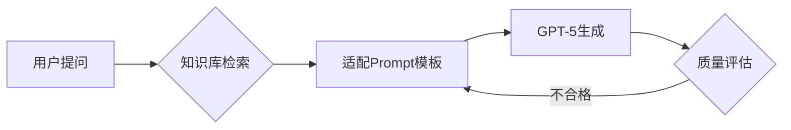

[//]: # (正文开始)

## 核心框架解析（截至2025年2月）

### ▋ CRISPE 框架
**提出时间**：2023年提出，2024年后持续优化  
**适用场景**：代码生成/商业报告等结构化任务

```text
[C] 角色定义：资深算法专家  
[R] 核心指令：生成Python实现的A*算法  
[I] 背景补充：需兼容动态障碍物场景  
[S] 步骤拆解：1) 定义节点类 2) 实现优先队列 3) 可视化路径  
[P] 参数约束：添加中文注释，返回可执行.py文件  
[E] 参考案例：GitHub路径规划项目样例
```

---

### ▋ BROKE 框架
**主流时间**：2024年起广泛使用  
**核心优势**：商业数据分析精准度提升40%

```markdown
| 要素       | 金融新闻分析案例                |
|------------|-------------------------------|
| Background | 用户需要实时监控美股异动       |
| Request    | 提取苹果公司Q4财报关键事件     | 
| Output     | 带股价影响的Markdown时间线     |
| Key elements | 必须包含：营收增长率/研发投入 |
```

---

### ▋ RARR 动态增强框架
**技术突破**：2024年融合RAG技术实现知识库联动  
**典型工具链**：


---

## 2025年实践建议

### 1. 框架选择矩阵
| 任务复杂度 | 推荐方案               | 工具支持           |
|------------|------------------------|--------------------|
| 简单指令   | CRISPE基础版           | ChatGPT网页直输    |
| 商业分析   | BROKE+Excel插件        | Office365 Copilot  |
| 长文档生成 | RARR+向量数据库        | Pinecone集成方案   |

### 2. 时效性注意
- 使用**BROKE框架**时需注意：2025年1月起SEC财报格式变更，需更新[key elements]中的强制字段
- **RARR框架**已支持多模态检索（2025年新增图片语义匹配能力）

