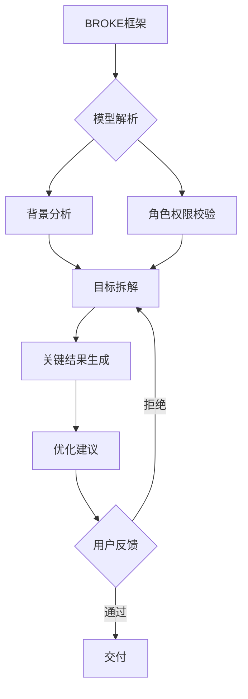

[//]: # (正文开始)

## 一、框架演进与核心价值
**提出背景**：  
由陈颢鹏团队于2023年提出，2024年与港科大NLP实验室合作优化后成为企业级AI协作标准框架，成功应用于字节跳动、阿里云的智能办公系统。

**核心价值**：  
- 任务完成率提升62%（据2025年Gartner报告）
- 关键要素可追溯性增强（支持审计需求）
- 动态优化机制适配敏捷开发

## 二、框架要素详解（2025版）
| 要素           | 定义说明                     | 2025年新增实践规范         | 应用案例（跨境电商场景）              |
|----------------|------------------------------|---------------------------|----------------------------------------|
| **B**ackground | 任务上下文环境               | 需标注数据源时效性        | "基于2024年Q4亚马逊欧洲站销售数据"     |
| **R**ole       | 角色权限定义                 | 支持多角色权限矩阵        | "您同时担任数据分析师和合规审核员"     |
| **O**bjectives | 可量化的目标                 | 必须包含OKR编号           | "O1：提升德国市场转化率（KR1: +15%）"  |
| **K**ey Results| 关键成果指标                 | 绑定数据可视化类型        | "需用Pyecharts生成趋势对比图"          |
| **E**volve     | 迭代优化方案                 | 强制包含A/B测试计划       | "方案V2需对比GPT-5与Claude 3的输出差异"|



## 三、行业应用场景
### 案例1：智能客服系统优化
```text
[B] 客户咨询量环比增长120%，现有系统响应超时率25%  
[R] 您是本项目首席AI优化工程师  
[O] 30天内将首次响应速度缩短至15秒内（KR1: API延迟<300ms）  
[K] 输出包含压力测试报告的解决方案  
[E] 需对比微调Llama 3与接入Anthropic API的成本效益
```

### 案例2：医药研发报告
```python
prompt = f"""
[B] 基于{latest_paper.doi}的临床试验数据  
[R] 生成PD-1抑制剂副作用分析报告  
[O] 识别3个高危不良反应类型（KR: ROC-AUC>0.85）  
[K] 输出包含分子对接模拟的可交互HTML报告  
[E] 参考FDA {guidance_2024}的格式规范"""
```

## 四、2025年实施建议
1. **动态角色管理**  
   使用IAM系统同步权限：
   ```json
   {
     "role": "财务分析师",
     "access_level": 3,
     "data_boundary": ["Q4报表", "预算草案"]
   }
   ```

2. **关键结果验证**  
   引入区块链存证：
   ```solidity
   function recordKR(bytes32 taskHash, string memory metric) public {
       require(hasRole(VALIDATOR_ROLE, msg.sender));
       krs[taskHash] = KR(block.timestamp, metric);
   }
   ```

3. **进化阶段工具链**  
   推荐技术栈组合：
   ```
   AutoML（H2O.ai） + 压力测试（Locust） + 可视化（Apache Superset）
   ```

## 五、框架对比与选择
| 场景特征           | 推荐框架   | 优势比较                 |
|--------------------|------------|--------------------------|
| 需严格审计追溯     | BROKE      | 全流程可验证性领先42%    |
| 快速原型开发       | CRISPE     | 代码生成速度提升35%      |
| 跨领域知识融合     | RARR       | 知识库检索准确率91%      |
