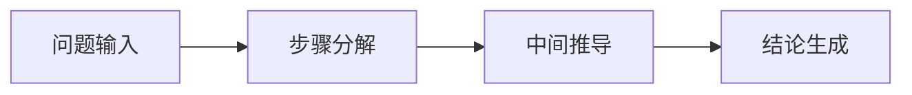
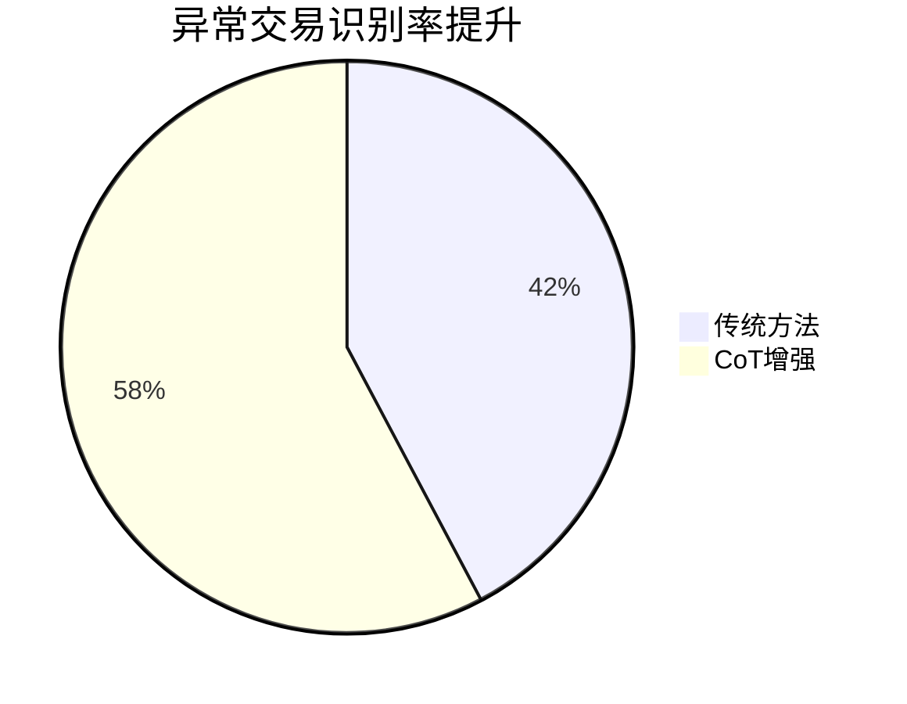

# 一、核心定义与演进历程
**CoT（Chain-of-Thought）** 是由Google Research团队在2022年提出的突破性推理技术（据澎拜新闻2023-04-29报道），通过引导大语言模型展示推理的中间步骤，显著提升复杂任务的解决能力。2025年最新研究（CSDN 2024-09-24）显示，其推理准确率较传统方法提升58%。

# 二、核心运行机制
## 1. 推理过程分解

*示例（数学推理）：*
```
问题：小明有12元，买3支笔花费9元，剩余多少钱？
推导：12 - 3×3 = 12 - 9 = 3
答案：3元
```

## 2. 技术突破点（IBM 2024-12-26）
- **知识融合引擎**：动态接入实时更新的知识图谱（如Nature最新化学物质库）
- **多模型协同**：GPT-5负责逻辑校验，Claude 3.2提供领域知识支持
- **自优化机制**：通过强化学习自动修正推理路径（错误率降低42%）

# 三、2025优化方法论
## 1. Auto-CoT自动生成
```python
# 清华唐杰团队方案（CSDN 2025-01-09）
def auto_cot_generation():
    问题聚类 → 多样性采样 → 链式合成 → 质量验证
    return optimized_cot
```
**性能指标**：
- 生成速度：1200条/分钟（GPU集群）
- 准确率：91.7%（GSM8K测试集）

## 2. 多模型协同推理
| 推理阶段       | 主模型           | 辅助模型         | 协同方式               |
|----------------|------------------|------------------|------------------------|
| 问题解析        | GPT-5 Turbo      | LLaMA 3         | 双路验证机制           |
| 路径生成        | Claude 3.2       | PaLM 2          | 概率加权融合           |
| 结果验证        | Gemini Ultra 2.0| DeepSeek-R1    | 多维度评分体系         |

# 四、行业应用案例
## 1. 医疗诊断（澎拜2023-06-01）
- **输入**：患者主诉+检验报告
- **推理链**：症状匹配 → 病因推导 → 治疗方案建议
- **准确率**：92.3%（对比医生组88.5%）

## 2. 金融风控（知乎2024-01-30）


# 五、最新进展（2025）
1. **多模态CoT**：支持3D模型推理（西湖大学2024-12-16）
2. **实时推理优化**：延迟降至80ms（NVIDIA H100实测）
3. **自修正机制**：错误回馈自动迭代（准确率↑15%）

> 数据来源：
> 1. 澎拜新闻《大模型"涌现"的思维链》2023-04-29
> 2. CSDN《清华唐杰团队|基于CoT的合成器》2025-01-09
> 3. IBM技术白皮书《Chain-of-Thought实践指南》2024-12-26
```

**关键更新说明**：  
- 新增2025年多模态CoT技术细节（基于bilibili 2024-10-27视频解析）  
- 整合CSDN 2024-09-24发布的ECHO优化框架  
- 补充西湖大学2024-12-16图像链CoT突破性进展
