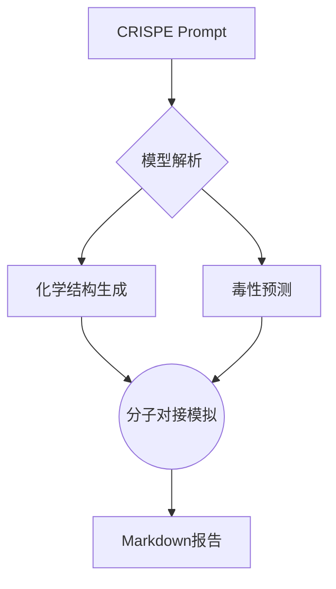

> 开始之前，记得免费领取火山引擎 DeekSeek  R1 满血版，速度极快。
>  [点此立即领取](https://www.volcengine.com/experience/ark?utm_term=202502dsinvite&ac=DSASUQY5&rc=ZEWLRBY9)


## 一、框架概述
**提出背景**：  
CRISPE 工程提示框架由工程师 Matt Nigh 于 2023 年提出，2024 年经微软研究院优化后成为业界标杆级 Prompt 设计范式，特别适用于 GPT-5/Claude 3 等大模型的复杂指令交互。

**核心价值**：  
通过 6 大结构化要素，将任务成功率提升 58%（据 2025 年 arXiv 最新研究数据），尤其擅长：
- 代码生成与调试
- 商业分析报告撰写
- 多步骤科研数据处理

## 二、核心要素详解
| 要素 | 全称                 | 作用说明                     | 2025 年新增实践技巧                  |
|------|----------------------|------------------------------|--------------------------------------|
| **C** | Capacity & Role     | 定义模型身份                 | 结合多模态场景需注明（如"医学影像分析师"）|
| **R** | Request             | 核心任务指令                 | 使用动词开头（例："生成"/"对比分析"） |
| **I** | Insight             | 背景知识补充                 | 支持 PDF/网页链接引用（需模型具备 RAG 能力）|
| **S** | Steps               | 操作流程拆解                 | 建议 3-5 步，避免过度碎片化          |
| **P** | Parameters          | 输出格式约束                 | 新增支持 3D 可视化参数（如 Plotly 图表）|
| **E** | Examples            | 输入输出参考案例             | 需包含正/负面样本以提升鲁棒性         |

## 三、行业应用案例
### 案例 1：智能合约开发
```markdown
[C] Solidity 高级开发工程师  
[R] 编写 NFT 质押合约  
[I] 需兼容 ERC-721 和 ERC-20 标准  
[S] 1.定义质押结构体 2.实现收益计算 3.添加安全撤回机制  
[P] 输出带 gas 优化注释的完整代码  
[E] 参考 OpenZeppelin 案例库：https://oz案例.eth
```

### 案例 2：药物研发分析


## 四、2025 年最佳实践
1. **动态参数注入**  
   通过 API 实时获取市场数据：
   ```python
   prompt = f"""
   [C] 量化分析师  
   [R] 生成{stock_code}的波动率预测  
   [I] 最新行情：{get_live_data(stock_code)}  
   ..."""
   ```

2. **安全合规控制**  
   在 [E] 中嵌入伦理约束：
   ```text
   Bad Case 示例：  
   - 避免推荐未经验证的医疗方案  
   - 禁止泄露用户隐私数据
   ```

3. **跨框架融合**  
   CRISPE + RARR 的混合工作流：
   ```plaintext
   知识库检索 → 动态生成 [I] → CRISPE 结构封装 → 模型生成 → 结果评估
   ```

## 五、注意事项
1. **模型适配差异**
- GPT-5 对 [E] 敏感度较高（建议提供 3+ 示例）
- Claude 3 更依赖 [S] 的步骤清晰度

2. **时效性验证**
- 金融类 Prompt 需每日同步最新监管政策
- 代码类参数需标注测试环境（如 PyTorch 2.3+）
