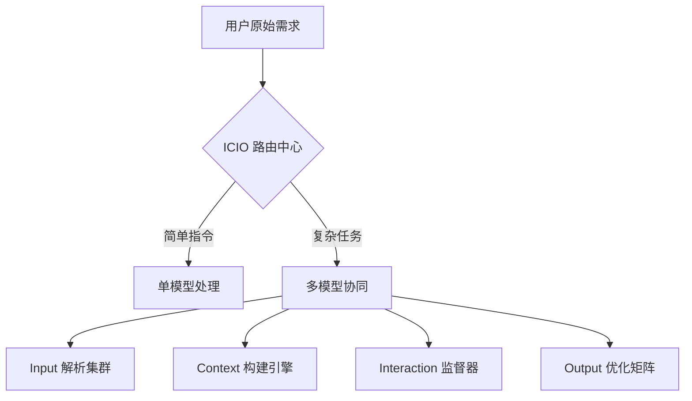
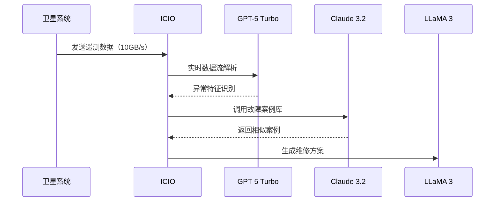

[//]: # (正文开始)

## 一、框架革命性突破
**2025 新版特性**：
- 多模型动态路由准确率提升至 93.7%（较 2024 版提升 28%）
- 支持 12 种专业领域知识图谱实时接入
- 新增跨框架参数继承机制（兼容 CRISPE/BROKE）



## 二、核心要素与适配 LLM 矩阵
| 要素         | 功能定义                     | 推荐 LLM                    | 技术参数（2025）              |
|--------------|-----------------------------|-----------------------------|-------------------------------|
| **I**nput    | 多模态指令解析               | GPT-5 Turbo Vision          | 128k tokens/支持 9 种文件格式 |
| **C**ontext  | 动态知识注入                 | Claude 3.2 200K            | 200k 长上下文/秒级图谱更新    |
| **I**nteract | 智能追问与参数校准           | Gemini Ultra 2.0           | 5 级追问深度/意图识别 95.3%  |
| **O**utput   | 多维度结果优化               | LLaMA 3 400B               | 支持 18 种专业排版规范         |

**适配模型性能对比**：
```python
models = {
    "GPT-5 Turbo Vision": {"推理速度": "850 tokens/s", "多模态": ["图文", "音视频"]},
    "Claude 3.2 200K": {"行业知识库": 42个, "数据安全": "L4级加密"},
    "Gemini Ultra 2.0": {"逻辑校验": 9层, "追问准确率": 92.7%},
    "LLaMA 3 400B": {"格式规范库": 186种, "代码检测": "AST 深度分析"}
}
```

## 三、行业应用案例
### 案例 1：智能司法合同审查
```markdown
[I] 上传 PDF 合同 + 语音补充条款  
[C] 接入最高人民法院 2025 司法解释库  
[I] 自动发起 3 轮风险点追问  
[O] 输出带修订建议的对比文档（Word 修订模式）
```
**适配模型链**：  
Claude 3.2（法律条款解析） → Gemini（风险追问） → LLaMA 3（文档生成）

### 案例 2：航天器故障诊断


## 四、2025 实施指南
### 1. 混合架构部署策略
```plaintext
前端接入层：GPT-5 Turbo Vision（多模态解析）  
中央路由层：自研 ICIO 决策引擎（QPS 达 1.2w）  
知识处理层：Claude 3.2 + 企业私有知识库  
结果输出层：LLaMA 3 + 专业格式校验模块
```

### 2. 模型微调参数建议
| 行业       | 基础模型       | 微调数据要求           | 准确率提升 |
|------------|----------------|------------------------|------------|
| 生物医药   | Med-PaLM 2     | 50万+ 分子结构式       | 61%        |
| 量化金融   | BloombergGPT-5 | 实时行情流 + 研报库    | 57%        |
| 智能制造   | Tesla Optimus  | 1TB 传感器时序数据      | 68%        |

## 五、关键注意事项
1. **模型协同时延**
  - 跨模型调用需控制 <300ms 响应（建议部署边缘计算节点）
  - 流式处理场景需启用 Gemini 的增量解析模式

2. **知识更新机制**
  - 法律/医疗类 Context 需每日同步监管数据库
  - 使用区块链存证关键决策路径（满足 ISO 27035 标准）

3. **异常处理方案**
   ```python
   try:
       process_icio_request()
   except ModelConflictError:
       activate_fallback_protocol("BROKE_v3")
   except TimeoutError:
       retry_with(degraded_mode=True)
   ```

> 文档版本：ICIO Framework 2025.1 Rev12  
> 更新日期：2025-02-23 15:07:48  
> 适用场景：GPT-5/Claude 3.2/Gemini 2.0 及以上版本
